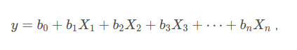
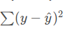

# 5-kaggle-competition
diamonds
*https://www.kaggle.com/c/diamonds-datamad0620/overview*

 
 

# Project Goals
The goal of this competition is the prediction of the price of diamonds based on their characteristics (weight, color, quality of cut, etc.), putting into practice all the machine learning techniques you know.
The goal is to predict a continuous target variable, it is said to be a **regression task**.
​ 
 

# Supervised learning: predicting an output variable from high-dimensional observations
sources: 
 https://scikit-learn.org/stable/tutorial/statistical_inference/supervised_learning.html 
          https://blog.quantinsti.com/linear-regression-models-scikit-learn/ 

*The problem solved in supervised learning* 

*Supervised learning consists in learning the link between two datasets: the observed data X and an external variable y that we are trying to predict, usually called “target” or “labels”. Most often, y is a 1D array of length n_samples.* 

*All supervised estimators in scikit-learn implement a fit(X, y) method to fit the model and a predict(X) method that, given unlabeled observations X, returns the predicted labels y.*  

Linear Regression problems also fall under supervised learning, where the goal is to construct a "model" or "estimator" which can predict the continuous dependent variable(y) given the set of values for features(X).

One of the underlying assumptions of any linear regression model is that the dependent variable(y) is (at least to some degree!) a linear function of the independent variables(Xis). That is, we can estimate y using the mathematical expression:

where, /(b_i\)s are the coefficients that are to be estimated by the model.

The cost function that we seek to minimize is the sum of squared errors(also referred to as residuals). This methodology is called the ordinary least squares(OLS) approach. In other words, we want those optimal values of bis that minimize  

 

 , where ^y is the value of y predicted by the model.
  
  

# Scikit-learn: Ensemble methods

The goal of ensemble methods is to combine the predictions of several base estimators built with a given learning algorithm in order to improve generalizability / robustness over a single estimator.

The best prediction methods for this diamond price prediction problem were found to be respectively: 
**1- GradientBoostingRegressor** 
tuned whit `params=(n_estimators = 100, loss='huber', min_samples_leaf=6, max_depth=7,max_leaf_nodes=250, min_samples_split=45)` 
`RMSE=474.89712806494185` 
**2- HistGradientBoostingRegressor** 
tuned whit `params=(max_depth=8, min_samples_leaf=6)` 
`RMSE=531.4433490228398` 
**3- RandomForestRegressor** 
tuned whit `params=(n_estimators=500, max_depth=15, min_samples_leaf=3, n_jobs=-1)` 
`RMSE=533.875343545384` 
**4- Extra Tree Regressor** 
tuned whit `params=(max_features='log2', n_jobs=-1)` 
`RMSE=546.6463913185166` 
**5- BaggingRegressor** 
tuned whit `params=(n_estimators=14)` 
`RMSE=547.4550303837045` 
**6- KNeighborsClassifier** 
tuned whit `params=(n_neighbors=1, algorithm='brute', p=1)` 
`RMSE=773.0013101770397` 
**7- Linear Regression** 
tuned whit `params=(without params)` 
`RMSE=1165.9673289710706` 
**8- GaussianNB** 
tuned whit `params=(without params)` 
`RMSE=1341.8201798533694` 

 

# Knowledge

* Scikit-learn
* Supervised Learning
* Gradien Boosting Regressor
* Random Forest Regressed
* BaggingRegressor
* Extra Tree Regressor
* KNeighborsClassifier
* Linear Regression
* GaussianNB
* Statistic
* Apache Spark
* Import external libraries
* Data Cleaning
 
 

# Links & Resources

- [https://scikit-learn.org/stable/supervised_learning.html]
- [https://scikit-learn.org/stable/modules/generated/sklearn.ensemble.GradientBoostingRegressor.html#sklearn.ensemble.GradientBoostingRegressor]
- [https://scikit-learn.org/stable/modules/classes.html#module-sklearn.ensemble]
- [https://scikit-learn.org/stable/modules/generated/sklearn.ensemble.RandomForestRegressor.html#sklearn.ensemble.RandomForestRegressor]
- [https://www.cienciadedatos.net/documentos/py04_machine_learning_con_h2o_y_python]
- [https://docs.h2o.ai/h2o/latest-stable/h2o-py/docs/intro.html]
- [https://gemologiamllopis.com/desesperacion-ignorancia-o-falta-de-formacion/]
- [https://sweetcode.io/simple-multiple-linear-regression-python-scikit/]